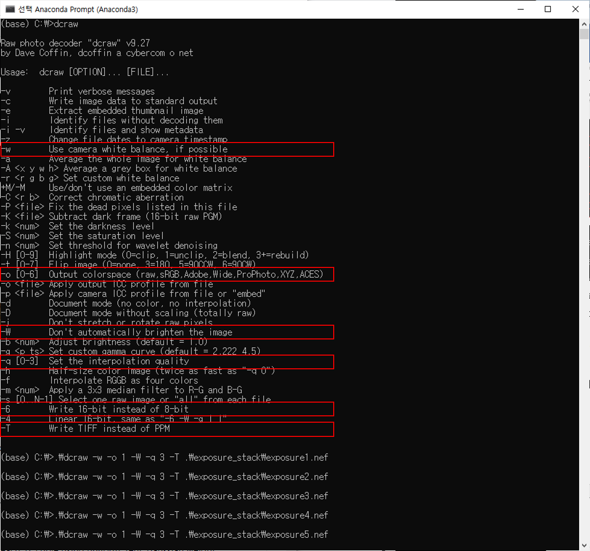
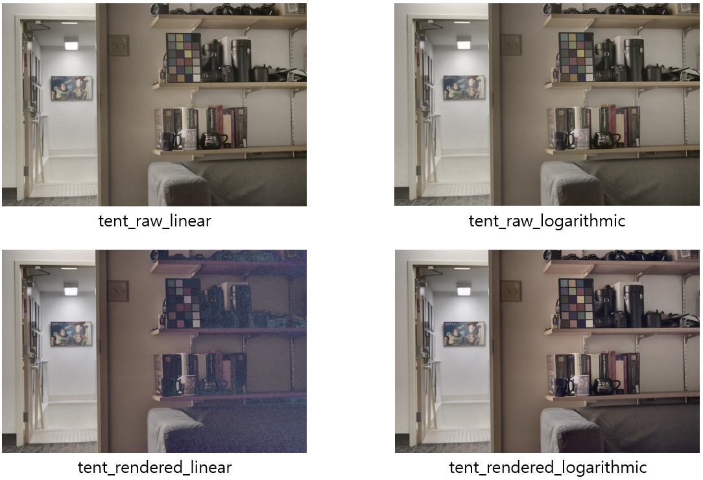

# Homework Assignment 4 

<p align='right'>
  2021314078 배은지
</p>

## HDR IMAGING

과제에 사용된 이미지의 특징

1. single exposure로 찍기 힘든 매우 다른 illumination과 dynamic range을 가진 영역이 있음
2. 두 영역 모두 결과의 색상 표현을 평가하는데 사용할 수 있는 여러 항목을 포함하고 있음
3. 결과의 해상도를 평가하는데 사용할 수 있는 높은 세부 기능 (lens/camera markings)
4. 색상 보정에 사용할 수 있는 색상 검사기가 있음

<p align='center'>
  
  <figcaption>Fig 1. Two LDR exposures, and an HDR composite tonemapped using the photographic tonemapping </figcaption>
</p>

#### Convert the RAW .NEF images into linear 16-bit .TIFF images
```dcraw```프로그램을 사용하여 RAW .NEF 이미지를 linear 16-bit .TIFF 이미지로 변환

사용한 flags

1. white balancing 수행
-w : Use camera white balance, if possible

2. sRGB를 출력 colorspace로 사용
-o 1 : Output colorspace (raw, sRGB, Adobe, Wide, ProPhoto, XYZ, ACES) / 1 sRGB D65 (기본값)

3. high-quality interpolation을 사용하여 demosaicing 수행
-q 3 : Set the interpolation quality / AHD (Adaptive Homogeneity-Directed) interpolation 사용

4. linear 16-bit .TIFF images
-T : Write TIFF instead of PPM
-6 : Write 16-bit instead of 8-bit

<p align='center'>
  
</p>

#### Linearize Rendered Images
- 비선형 렌더링 이미지를 선형으로 변화하고자 함
- 수식(2)을 이용하여 least squares optimization problem을 해결
<p align='center'>
  
</p>

- lambda는 'g'곡선의 스무딩에 제한을 줌
- 아래 그림의 첫 줄은 `lambda=500`, 두번째 줄은 `lambda=1000`

<p align='center'>
  
</p>

```matlab
if strcmp(WEIGHT_TYPE, 'uniform') 
    for i=1:256
        if Zmin <= (i - 1) / 255 && (i - 1) / 255 <= Zmax
            w(i, 1) = 1;
        end
    end
elseif strcmp(WEIGHT_TYPE, 'tent') 
    for i=1:256
        if Zmin <= (i - 1) / 255 && (i - 1) / 255 <= Zmax
            Zvalue = (i - 1) / 255;
            w(i, 1) = -2 * abs(2*Zvalue-1) + 2;
        end
    end
elseif strcmp(WEIGHT_TYPE, 'gaussian') 
    for i=1:256
        if Zmin <= (i - 1) / 255 && (i - 1) / 255 <= Zmax
            Zvalue = (i - 1) / 255;
            w(i, 1) = normpdf(Zvalue, 0.5, 1/6);
        end
    end
```

#### Merge Exposure Stack into HDR Image
- HDR 이미지로 병합하고자 함
- linear merging :
<p align='center'>
  
</p>

- logarithmic merging :
<p align='center'>
  
</p>

<p align='center'>
  
  
  
</p>

#### Evaluation
- color checker
- 패치 4,8,12,16,20,24는 거의 완전한 중립 패치이므로 이상적인 HDR 이미지라면 직선이 생김

<p align='center'>
  
</p>

```matlab
e = 0;
figure;
for idx_weight=1:3
    for idx_merge=1:2
        e = e + 1;
        X = ones(6, 2);
        y = zeros(6, 1);
        for i=1:6
            intensity(idx_weight, idx_merge, i) = log(mean(mean(mean(image_stack{idx_weight, idx_merge}(position(i, 2):position(i, 4), position(i, 3):position(i, 1), 2)))));
 
            y(i, 1) = intensity(idx_weight, idx_merge, i);
            X(i, 2) = i;
        end
        % Linear regression solver
        b = X \ y;
        yCalc = X * b;
        
        Rsq = 1 - sum((y - yCalc).^2) / sum((y - mean(y)).^2);
        
        subplot(3, 2, e);
        plot(X(:, 2), yCalc);
        hold on;
        scatter(X(:, 2), y);
        hold off;
        title(sprintf('%s %s', weight_type{idx_weight}, merge_type{idx_merge}));
    end
end
```
